# Crime, Poverty and Median Home Values
Our hypothesis is the following. We hypothesize that a decrease in the violent crime rate results in reductions in the poverty rate and a simultaneous increase in median income and median home prices. Our confidence level is 95% or a p-value of 0.05. We hypothesize that the p-value of these statistics in Oak Park, zip codes 95817 and 95820, is statistically different from Sacramento County. Our observed variables are the crime rate, poverty rate, income rate, and median home prices of Oak Park and Sacramento County. Our expected values are the crime rate, poverty rate, income rate, and median home prices for all of Sacramento County. Based on the observed versus the typical values, we can calculate the p-value. If the p-value is less than 0.05, we will accept the hypothesis. This analysis matters as police forces could use it to understand better where to assign resources.
## Questions
1.	What are the total crime trends in Sacramento County and Oak Park in particular?
2.	What are the Oak Park crimes and personal crimes for 2014-2018?
3.	How would a heat map of the crime for each zip code in Sacramento county look appear?
4.	How would a heat map of the poverty rate for each zip code in Sacramento count appear?
5.	What are the overall personal crimes versus poverty for Sacramento county for 2014-2018?
6.	Is there a correlation between the poverty rate and the crime rate
7.	Is there a correlation between home prices and the crime rate?
## Data Sources and Data Cleaning
Our first data source is http://www.ciclt.net/sn/clt/capitolimpact/gw_ziplist.aspx?FIPS=06067. This website contains a simple web page that lists the zip codes in Sacramento County. By manually creating a CSV file meant no data cleaning.  
Our second data source was the Census API. The Census was more problematic. The Census required two different types of API calls:  
•	One through the request/JSON path; we needed this difference because the API changed for the acs5 path  
•	One through the Census.acs5 path  
The Census data needed the following cleaning steps:  
•	Dropna  
•	Drop housing prices that are outside of a normal range  
•	Drop zip codes that had incomplete data  
Our third data set is https://data.saccounty.net/datasets/9a7f2df25a584ff9b55db274704ad7c9_0/geoservice. This site provided a CSV file with all of the reported crimes from 2003-2019. We only used a subset of this data, 2014-2018, as this is the latest five year period we could get from the Census data. This data was pretty raw and needed a lot of cleaning. The steps involved included:  
•	Removing bad zip codes, including empty zip codes, zip codes that were a single space, truncated  zipcodes, and null zip codes  
•	Renaming columns  
•	Creating a Year Column by parsing out the year from the time stamp  
•	Filtering to just 2014-2018  
•	Creating a "PC" column that just contained the Penal Code Violation number as a float  
o	This process involved running many regular expressions over the column to eliminate non-PC violations  
Our fourth data set was the Google Maps API. Google Maps only needed cleaning through try/except blocks.
## Question Analysis
Our analysis begins with this question:
1.	What are the overall crimes and personal crimes for Sacramento county for 2014-2018?
To answer this question, we look at the following graph, which shows the total crime and personal crimes (rapes, murders, etc.) for Sacramento over 2014-2018.
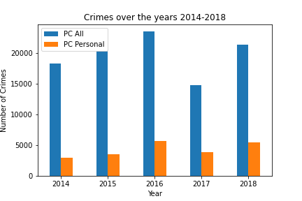

The diagram above shows that crime is overall flat in Sacramento County. 
The next question is:  
2.	What are the Oak Park crimes and personal crimes for 2014-2018?  
The following graph shows what is happening in Oak Park over 2014-2018.
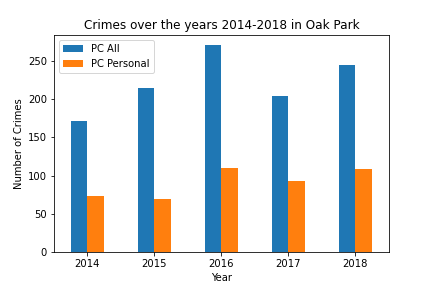
  
The diagram above shows that crime is overall flat in Oak Park as well.  
The next question is:  
3.	How would a heat map of the crime for each zip code in Sacramento county look appear?  
The next thought is, what does crime look like over Sacramento when looking at a heat map. Are there any hot spots? Did crime change significantly between 2014 and 2018? The following diagrams show us this. The first is a heat map of crimes in 2014.

The following diagram is a heat map of crimes in 2018.
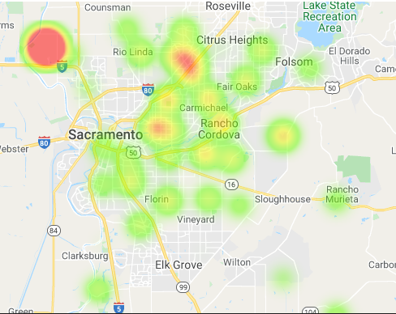

These two heat maps show us two things:  
•	Crime did not change overall across the County from 2014-2018  
•	There seems to be a huge hot spot in one of the zip codes when it comes to crime  
The next question is:  
4.	How would a heat map of the poverty rate for each zip code in Sacramento count appear?
If heat maps for crime have not changed, can we say the same for poverty? The first diagram is a poverty heat map for 2014.
  
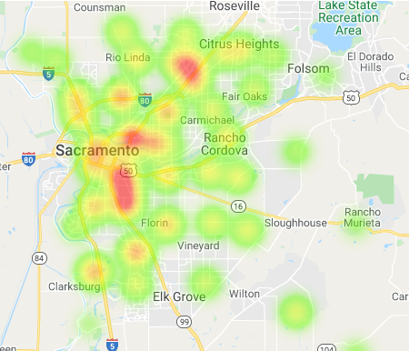

The following diagram is a heat map of poverty in 2018.
  
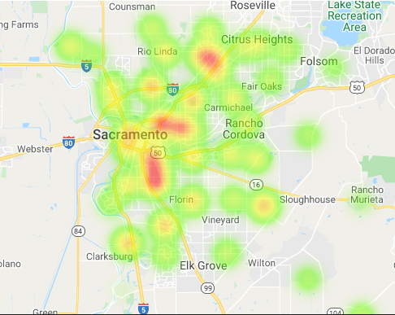
  
So, these heat maps show that poverty also has not changed significantly over this period.  
The next question is:  
5.	What are the overall personal crimes versus poverty for Sacramento county for 2014-2018?  
The next step in the analysis is to look for outliers over the years. We show this with a box plot below.

The box plot shows us there is at least one significant outlier each year. We need to dive down a little further by using a bar plot crime across all Sacramento counties to see the outlier. The bar graph below illustrates this.

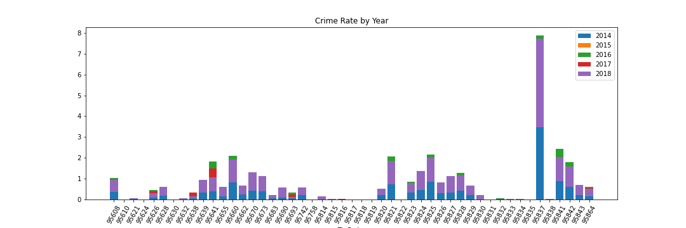

The bar graph above clearly illustrates we have an outlier, 95837. The 95837 zip code is removed from further analysis as it will throw off subsequent calculations.  
The next question is:  
6.	Is there a correlation between the poverty rate and the crime rate
Using the data without the crime rate outliers, we example scatter plots for Poverty Rate versus Crime Rate for 2014-2018. All of the graphs are shown below with their p-value and r^2 value. We provide further analysis after the charts. The expectation is that as the poverty rate goes up, the crime rate goes up.

p-value = 0.03  
r^2 value = 0.09

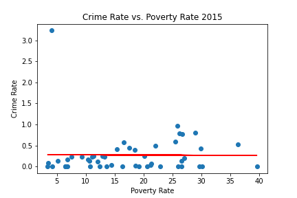

p-value = 0.02  
r^2 value = 0.12

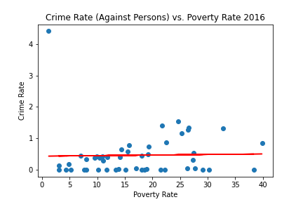

p-value = 0.01  
r^2 value = 0.14

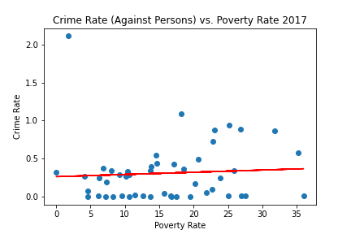

p-value = 0.03  
r^2 value = 0.09

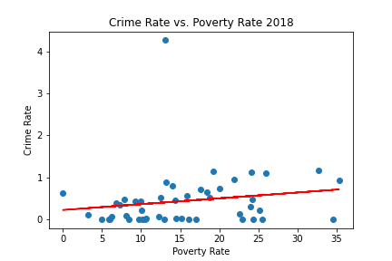

p-value = 0.01  
r^2 value = 0.13    
Note: the average p-value is 0.02 and the average r^2 value is 0.12. Given these values and the look of the diagrams, we can see that, in general, as povery rate goes up, crime rate also goes up.  
Now, we want to examine what happens specifically in Oak Park. The diagram below illustrates the Crime Rate versus Poverty Rate over 2014-2017 in Oak Park.

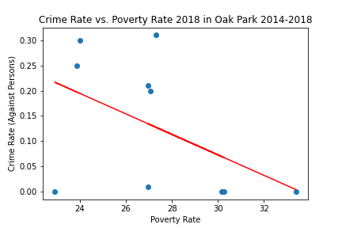

p-value = 0.23  
r^2 value = 0.16  
This diagram shows that Oak Park bucks the trend in Sacramento County as a whole as the Crime Rate goes down as the Poverty Rate goes up.  
The next question is:  
7.	What are the overall personal crimes versus home prices for Sacramento County for 2014-2018?  
Using the data without the crime rate outliers, we example scatter plots for Median Home Value versus Crime Rate for 2014-2018. All of the graphs are shown below with their p-value and r**2 value. We provide further analysis after the charts. The expectation is that as the Median Home Value goes up, the crime rate goes down.

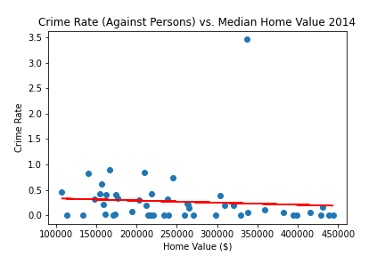

p-value = 0.00  
r^2 value = 0.17  

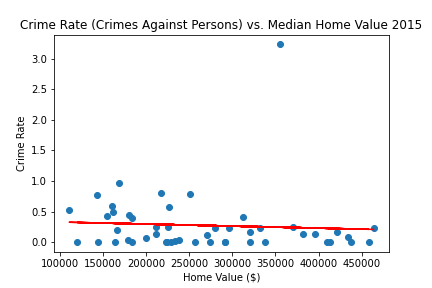

p-value = 0.01  
r^2 value = 0.13  

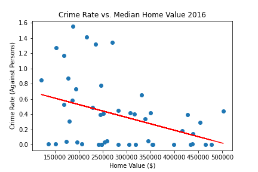

p-value = 0.01  
r^2 value = 0.15  

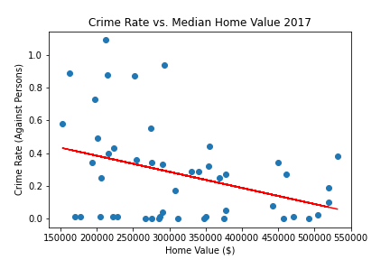

p-value = 0.01  
r^2 value = 0.13  

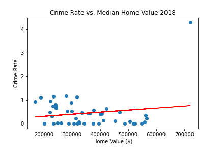

p-value = 0.00  
r^2 value = 0.17  
Note: the average p-value is 0.01 and the average r^2 value is 0.15. Given these values and the look of the diagrams, we can see that, in general, as Median Home Price goes up, crime rate goes down.  
Now, we want to examine what happens specifically in Oak Park. The diagram below illustrates the Crime Rate versus Poverty Rate over 2014-2017 in Oak Park.  

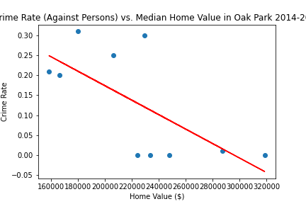

p-value = 0.03  
r**2 value = 0.46  
The Oak Park diagram shows that Oak Park follows the overall trend of rising Median Home Values equating to lower crime rates.
## Overall Analysis
We had a couple of hypotheses:    
•	Rising Median Home Prices leads to Lower Crime Rates  
•	Rising Poverty Rates leads to Higher Crime Rates  
The data for Sacramento County overall met these expectations. When we looked explicitly at Oak Park, results from the data were mixed. Oak Park had a lowering Crime Rate as Median House Price went up, as expected. Oak Park also had a lowering Crime Rate as the Poverty Rate went up. More research into Oak Park is needed to understand the discrepancy better
